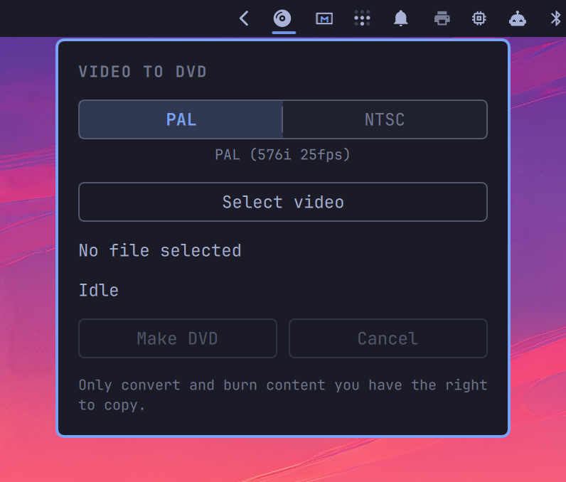

# Video to DVD

[](https://github.com/tcballard/omarchy-badges)

Version 1.1.0

Omarchy bar widget: pick a video → PAL or NTSC DVD-Video ISO → wait for a blank disc → burn → eject.

Uses AMD AMF hardware encoding (`mpeg2_amf`) when available. The bar icon is a monochrome disc glyph, so it follows the current theme.



## Install

```sh
omarchy plugin add https://github.com/Ruegen/omarchy-video-to-dvd.git --enable
```

Or copy the repo into `~/.config/omarchy/plugins/io.github.ruegen.video-to-dvd/` and reload the Omarchy shell.

The panel talks to a Rust helper (`oma-dvd`) that still runs ffmpeg, dvdauthor, genisoimage/mkisofs, and growisofs. Missing Arch packages are installed from the panel with `omarchy-pkg-add`. `eject` comes from util-linux.

Build the helper after a git checkout:

```sh
cargo build --release --locked && ./target/release/oma-dvd install-helper
```

## Usage

1. Click the disc icon on the bar.
2. Select video and standard (PAL / NTSC).
3. Make DVD.
4. Insert a blank disc when asked. Cancel anytime.

After a successful burn the ISO is deleted and the tray ejects. A long filename is elided in the panel.

## Remove

```sh
omarchy plugin remove io.github.ruegen.video-to-dvd
```

That disables the widget and deletes the plugin checkout. It does not uninstall Arch packages the panel may have added.


## Update

```sh
omarchy plugin update io.github.ruegen.video-to-dvd
```

## Packages

Official Arch repos. The panel can install missing ones with `omarchy-pkg-add`:

- ffmpeg
- dvdauthor
- cdrtools (genisoimage / mkisofs)
- dvd+rw-tools (growisofs, dvd+rw-mediainfo)

`eject` comes from util-linux (already on Arch). Building `oma-dvd` needs `rust` / `cargo`.

## Translations

UI text lives in `i18n/`. English is the default; German is included.

To add a language, copy `i18n/en.json` to something like `i18n/fr.json` and translate the values. Leave the keys as they are. The plugin follows your system language.

## Tests

Helper unit tests (leftover encode time, blank-disc parsing, path/ISO safety) without a drive or a full encode:

```sh
cargo test
```

## License

MIT. You can use, copy, and modify this plugin, including commercially.

The Arch packages this plugin runs keep their own licenses (GPL, LGPL, CDDL).

You are responsible for only converting and burning content you have the right to copy.
