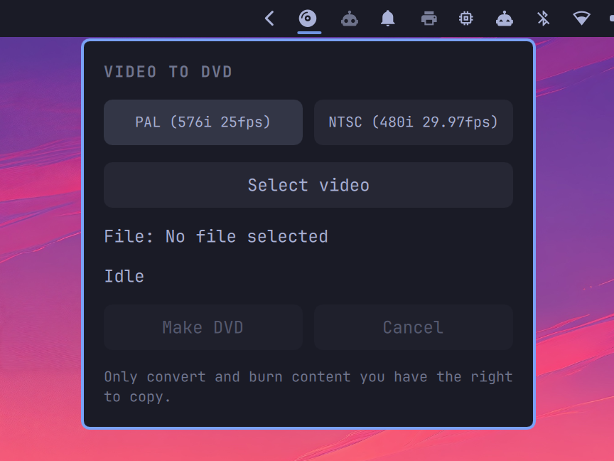

# Video to DVD

Omarchy bar widget: pick a video → PAL or NTSC DVD-Video ISO → wait for a blank disc → burn → eject.

Uses AMD AMF hardware encoding (`mpeg2_amf`) when available. The bar icon is a monochrome disc glyph, so it follows the current theme.



## Usage

1. Click the disc icon on the bar.
2. Select video and standard (PAL / NTSC).
3. Make DVD.
4. Insert a blank disc when asked. Cancel anytime.

Missing packages show an Install button. After a successful burn the ISO is deleted. A long filename is elided in the panel.

## Packages

Official Arch repos. The panel can install missing ones with `omarchy-pkg-add`:

- ffmpeg
- dvdauthor
- cdrtools (genisoimage / mkisofs, cdrecord)
- dvd+rw-tools (growisofs, dvd+rw-mediainfo)
- bc

`eject` comes from util-linux (already on Arch).

## Install

```bash
omarchy plugin add https://github.com/Ruegen/omarchy-video-to-dvd.git
```

Or copy the repo into `~/.config/omarchy/plugins/io.github.ruegen.video-to-dvd/` and reload the Omarchy shell.

## Translations

UI text lives in `i18n/`. English is the default; German is included.

To add a language, copy `i18n/en.json` to something like `i18n/fr.json` and translate the values. Leave the keys as they are. The plugin follows your system language.


## Tests

Shell helpers (leftover encode time, blank-disc parsing, progress lines) without a drive or a full encode:

```bash
bash tests/run.sh
```

## License

MIT. You can use, copy, and modify this plugin, including commercially.

The Arch packages this plugin runs keep their own licenses (GPL, LGPL, CDDL).

You are responsible for only converting and burning content you have the right to copy.
